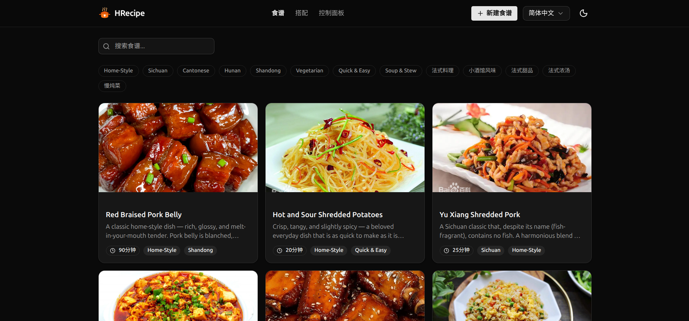
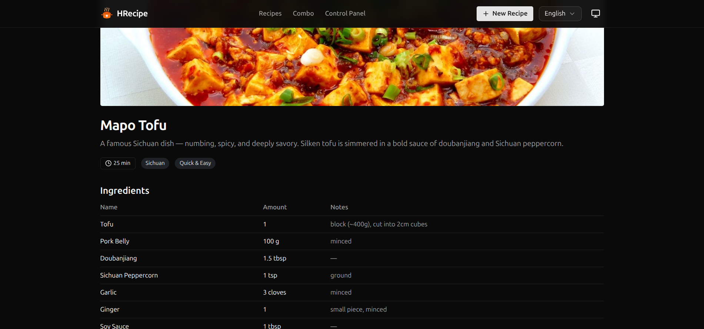
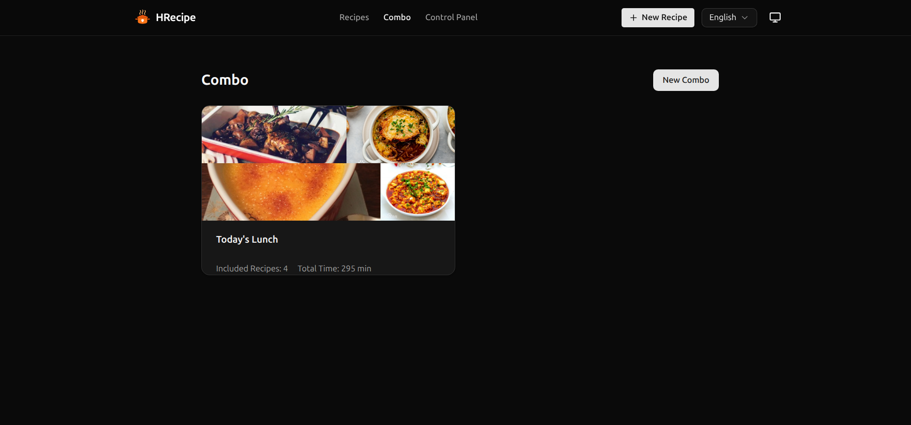
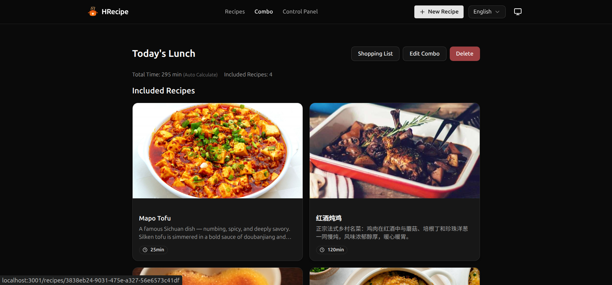
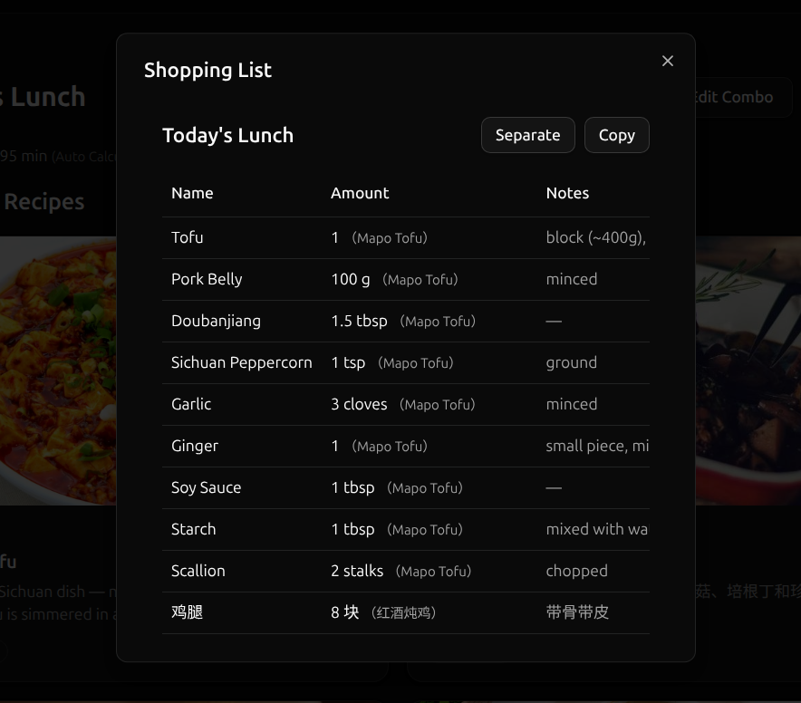
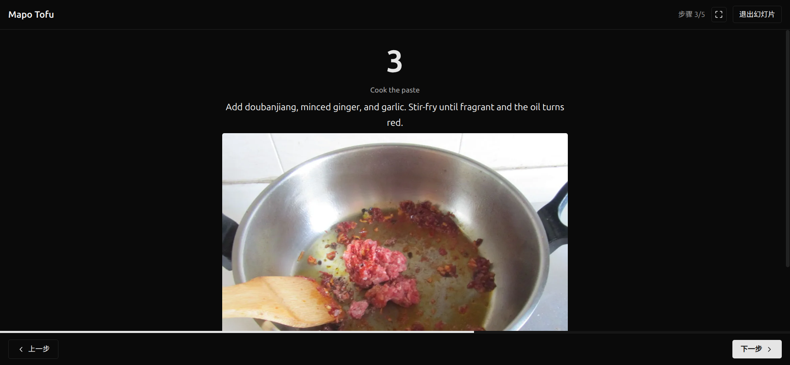

<div align="center">
  
  <h1>HRecipe</h1>
  <p><b>可爱的家庭食谱管理应用，专注于实用性。</b></p>
  <p>
    <a href="README.md">English</a>&nbsp;&nbsp;|&nbsp;&nbsp;<b>简体中文</b>
  </p>
</div>

---

## UI/UX

<table>
  <tr>
    <td width="50%"></td>
    <td width="50%"></td>
  </tr>
  <tr>
    <td align="center">食谱列表 - 搜索 & 标签筛选</td>
    <td align="center">食谱详情 - 食材、步骤一览</td>
  </tr>
  <tr>
    <td width="50%"></td>
    <td width="50%"></td>
  </tr>
  <tr>
    <td align="center">搭配列表</td>
    <td align="center">搭配详情 - 多道菜组合规划</td>
  </tr>
  <tr>
    <td width="50%"></td>
    <td width="50%"></td>
  </tr>
  <tr>
    <td align="center">购物清单 - 自动合并 & 一键复制</td>
    <td align="center">烹饪幻灯片 - 边看边做</td>
  </tr>
</table>

## 功能

- **食谱管理** - 创建、编辑、删除食谱；Markdown 描述 & 步骤；支持多图上传
- **食材 & 标签** - 统一管理食材库与标签体系，快速搜索和筛选
- **搭配（Combo）** - 将多道菜组合为一顿饭，自动计算总烹饪时间
- **购物清单** - 根据食谱或搭配自动生成，同名食材智能合并，支持分组/合并视图，一键复制为纯文本
- **烹饪幻灯片** - 全屏逐步展示烹饪步骤与配图，边看边做
- **评价系统** - 家人可对食谱打分和评论（可通过环境变量关闭）
- **导入导出** - 可将食谱导出为 markdown 文件或通过 markdown 文件导入食谱
- **国际化 (i18n)** - 完整的国际化支持，自动检测浏览器语言
- **深色/浅色主题** - 自动跟随系统 or 手动切换
- **MCP Server** - 内置 [Model Context Protocol](https://modelcontextprotocol.io) 服务端，AI 助手可直接管理食谱
- **购物清单** - 购物清单可导出为文本，方便发送分享
- **SQLite 数据库** - 零配置、单文件持久化，适合家庭场景
- **Docker 一键部署** - 单条命令即可运行

## 部署

### Docker Run

```bash
docker run -d \
  --name hrecipe \
  -p 3000:3000 \
  -v hrecipe-data:/app/data \
  ghcr.io/ykdz/hrecipe
```

访问 `http://localhost:3000` 即可使用。

数据（SQLite 数据库 + 上传的图片）持久化在 `/app/data` 目录中。

### Docker Compose

创建 `compose.yml`：

```yaml
services:
  hrecipe:
    image: ghcr.io/ykdz/hrecipe
    container_name: hrecipe
    restart: unless-stopped
    ports:
      - "3000:3000"
    volumes:
      - hrecipe-data:/app/data
    environment:
      - TITLE=HRecipe
      - FALLBACK_LOCALE=zh-CN
      - REVIEWS_ENABLED=true
      - HIDE_LANGUAGE_SWITCHER=false
      - FORCE_FALLBACK_LOCALE=false
      - MAX_FILE_SIZE=52428800

volumes:
  hrecipe-data:
```

```bash
docker compose up -d
```

## 环境变量

| 变量                     | 默认值                 | 说明                                       |
| ------------------------ | ---------------------- | ------------------------------------------ |
| `PORT`                   | `3000`                 | 服务监听端口                               |
| `DATABASE_URL`           | `/app/data/recipes.db` | SQLite 数据库文件路径                      |
| `UPLOAD_DIR`             | `./data/uploads`       | 上传图片存储目录                           |
| `MAX_FILE_SIZE`          | `52428800` (50 MB)     | 单个上传文件大小上限（字节）               |
| `TITLE`                  | `HRecipe`              | 页面标题                                   |
| `REVIEWS_ENABLED`        | `true`                 | 是否启用评价系统（`true` / `false`）       |
| `FALLBACK_LOCALE`        | `zh-CN`                | 回退语言（无法检测浏览器语言时使用）       |
| `HIDE_LANGUAGE_SWITCHER` | `false`                | 是否隐藏语言切换器（`true` 隐藏）          |
| `FORCE_FALLBACK_LOCALE`  | `false`                | 强制使用回退语言，忽略浏览器和 Cookie 设置 |

> **提示**：如果只需要中文界面，可设置 `FORCE_FALLBACK_LOCALE=true` + `HIDE_LANGUAGE_SWITCHER=true`。

## MCP 集成

HRecipe 内置了 [Model Context Protocol](https://modelcontextprotocol.io) 服务端，路径为 `/mcp`。

支持让 AI 助手（如 Claude、GitHub Copilot 等）通过 MCP 协议直接管理你的食谱数据，包括：

- 查询/创建/编辑/删除食谱、食材、标签、搭配、评价
- 搜索食谱（按名称、描述、标签）
- 生成购物清单（支持合并 & 文本输出）

MCP 配置示例：

```json
{
  "servers": {
    "hrecipe": {
      "type": "streamable-http",
      "url": "http://localhost:3000/mcp"
    }
  }
}
```

## 尾声

由 [YKDZ](https://github.com/YKDZ) 用 ❤️ 和 `GitHub Copilot` 制作。
